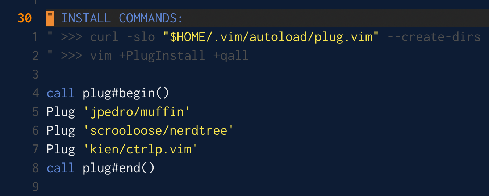

# Muffin

Muffin is utility belt functions and a dark colour theme for vim.



### Installation

<!--
Muffin can be easily installed with [vundle](https://github.com/gmarik/vundle).
Add this line after `call vundle#begin()`:

```vim
Bundle 'jpedro/muffin'
```

Then run `vim +PluginInstall +qall` (or `:PluginInstall` inside vim).
-->

Muffin can be easily installed with [vim-plug](https://github.com/junegunn/vim-plug).

Add this to your `~/.vimrc`:

```vim
call plug#begin()
Plug 'jpedro/muffin'
" Other less import stuff
" ...
call plug#end()
```

Then run `vim +PlugInstall +qall` (or `:PlugInstall` inside vim).
