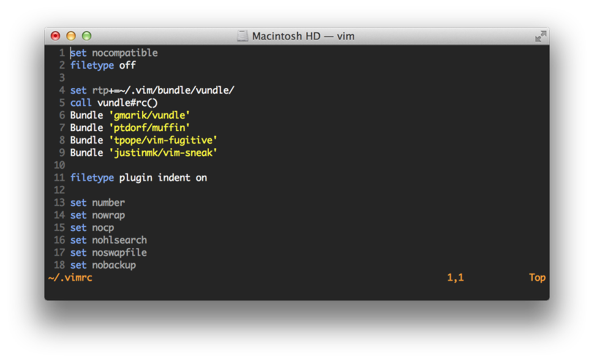

# Muffin

Muffin is utility belt functions and a dark colour theme for vim.



### Installation

Muffin can be easily installed with [vundle](https://github.com/gmarik/vundle).
Add this line after `call vundle#begin()`:

```vim
Bundle 'jpedro/muffin'
```

Then run `vim +PluginInstall +qall` (or `:PluginInstall` inside vim).
